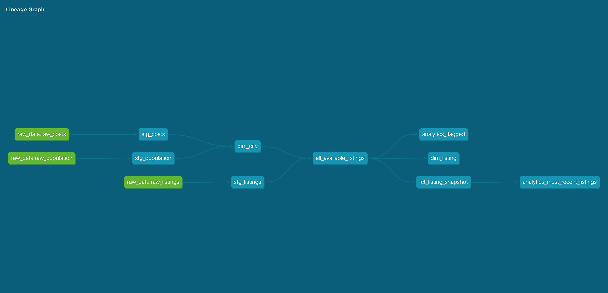

# Global Short-Term Rentals - a Data Warehouse and Dashboard

The global short-term rentals project is a full data pipeline and warehouse. A dashboard allows for the exploration of the impact of short-term rental listings (Airbnb) and its impacts on housing. Data is pulled from three separate public datasets and consists of over 35 million records from 2015-2020. 

## Architecture:
### Overview
* Python scripts perform API calls and web scraping for extraction and loading.
* Snowflake is the cloud-based data warehouse.
* DBT is used for transformations.
* X used for data visualizations.

### Data Sources
* Scraped data from:
  - [Inside Airbnb](http://insideairbnb.com/get-the-data.html). [CC0 1.0 Public Domain Dedication](https://creativecommons.org/publicdomain/zero/1.0/).
* Kaggle
  - [World Cities Population and Location](https://www.kaggle.com/i2i2i2/cities-of-the-world). CC0: Public Domain.
  - Kaggle [Cost of Living Indices](https://www.kaggle.com/debdutta/cost-of-living-index-by-country). Original source [Numbeo](https://www.numbeo.com/cost-of-living/rankings.jsp)

### ETL Pipeline
### Data Modeling

### Visualization

## Environment Setup:
### To reproduce the warehouse, you will need to have several cloud-based accounts set up prior to running the installation steps:
1. You will need to have a Kaggle account and authenticate using an API token. For more information read Kaggle's [API documentation](https://www.kaggle.com/docs/api).
2. You will need a Snowflake account with privileges. Set environment variables for username, password, and account. `export SNOW_USER=<your user name>`, `export SNOW_PASS=<your password>`, `export SNOW_ACCOUNT=<your Snowflake account>`

## Installation:
### Scripts to download datasets and setup the warehouse:
1. Download the repository and create a virtual environment.
2. Install the required dependencies with `pip install -r requirements.txt`.
4. To extract datasets (scraping and API calls) run `python src/extract.py`. This may take a few hours.
6. To load data run `python src/load.py`.

## Author:
A personal project by Rebecca Sanjabi.
