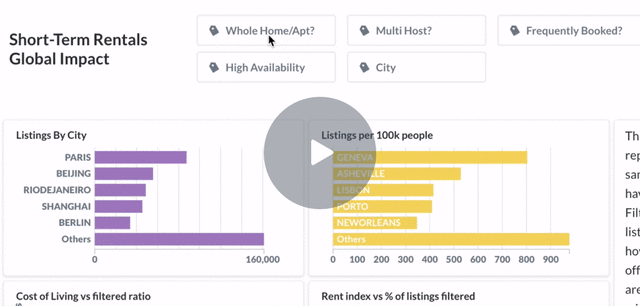
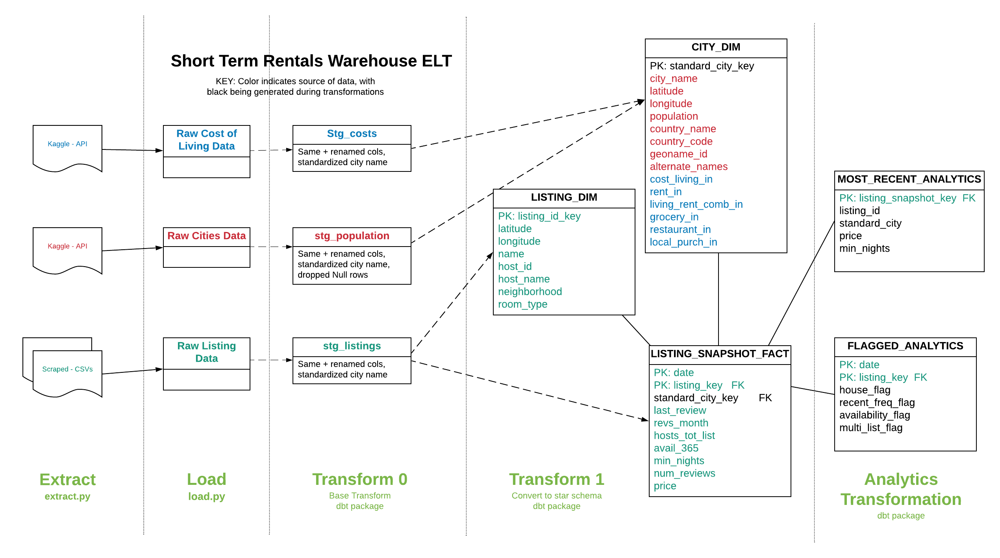
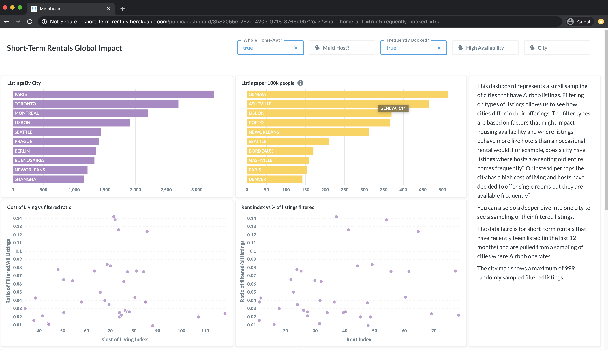

# Global Short-Term Rentals - a Data Warehouse and Dashboard

The global short-term rentals project is a full data pipeline and warehouse. A dashboard allows for the exploration of the impact of short-term rental listings (Airbnb) on housing. Data is pulled from three separate public datasets and consists of over 35 million records from 2015-2020. 

## Architecture:
### Overview
* Python scripts perform API calls and web scraping for extraction and loading.
* Snowflake is used as a cloud-based data warehouse.
* DBT is used for transformations, data testing, and data documentation.
* Metabase hosted on Heroku is used for data visualizations.

### Data Sources
* Scraped data from:
  - [Inside Airbnb](http://insideairbnb.com/get-the-data.html). [CC0 1.0 Public Domain Dedication](https://creativecommons.org/publicdomain/zero/1.0/).
* Kaggle
  - [World Cities Population and Location](https://www.kaggle.com/i2i2i2/cities-of-the-world). CC0: Public Domain.
  - Kaggle [Cost of Living Indices](https://www.kaggle.com/debdutta/cost-of-living-index-by-country). Original source [Numbeo](https://www.numbeo.com/cost-of-living/rankings.jsp)

### ETL and Data Model

### DBT Model DAG

### Visualization
A [working dashboard](http://short-term-rentals.herokuapp.com/public/dashboard/3b82055e-767c-4203-9715-3765e9b72ca7) is available from a Metabase server hosted on Heroku.

A [video demonstration](https://www.loom.com/share/bb3c33b3096a46a285060986ff87cb01) is also available.

Screen shots:

## Environment Setup:
### To reproduce the warehouse, you will need to have these cloud-based accounts set up prior to running the remaining steps:
1. You will need to have a Kaggle account and authenticate using an API token. For more information, read Kaggle's [API documentation](https://www.kaggle.com/docs/api).
2. You will need a [Snowflake account](https://trial.snowflake.com/) with sysadmin privileges. They offer a 30-day trial with up to $400 in free usage. This project uses well under that, and no credit card is required until the limits are reached.

### To setup the warehouse:
1. Download the repository and create a virtual environment.
2. Install the required dependencies with `pip install -r requirements.txt`.
3. Copy .env.example to a file called .env at the root level of the project. Add in relevant Snowflake and dbt environment variables.
4. If using a bash shell, run `set -o allexport; source .env; set +o allexport` to export credentials and other environment variables. You'll need to make adjustments on a Windows machine.

### Extract, load, and transform data:
1. Setup users, databases, and warehouses on Snowflake. Use `src/create_warehouse.sql` as a guide.
2. To extract datasets (scraping and API calls), run `python src/extract.py`. The script may take a few hours.
3. To load data, run `python src/load.py`. Again, depending on your connection, will take awhile.
4. To install dbt dependencies, from dbt subdirectory run `dbt deps`.
5. To transform data, from dbt subdirectory run `dbt run`.
6. To test your data, from dbt subdirectory run `dbt test`.
7. To generate documentation, from dbt subdirectory run `dbt docs generate`, and `dbt docs serve` for locally hosted documentation.

### Visualization:
1. Download and install [Metabase](https://www.metabase.com/start/) on the platform of your choice (I used Heroku).
2. Follow setup instructions for an admin user and add your Snowflake credentials.
3. Create a new dashboard.
4. Create questions for each card based on the files in `visualizations/`, adjusting the visualization component.

## Author:
A personal project by Rebecca Sanjabi.
